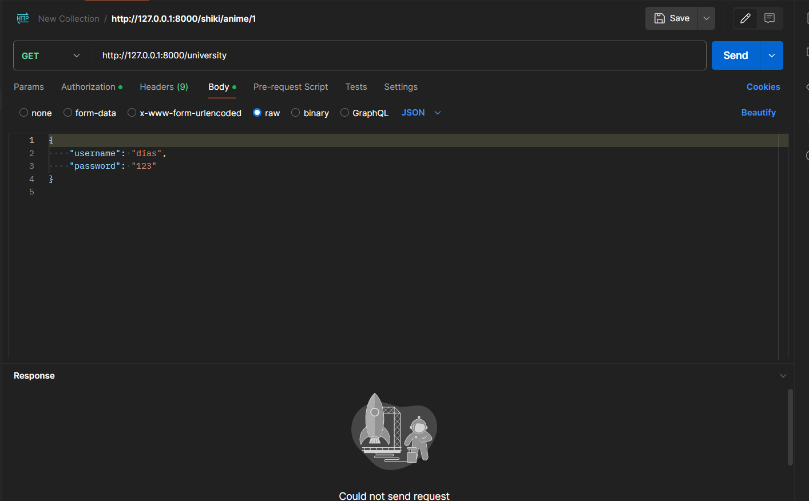
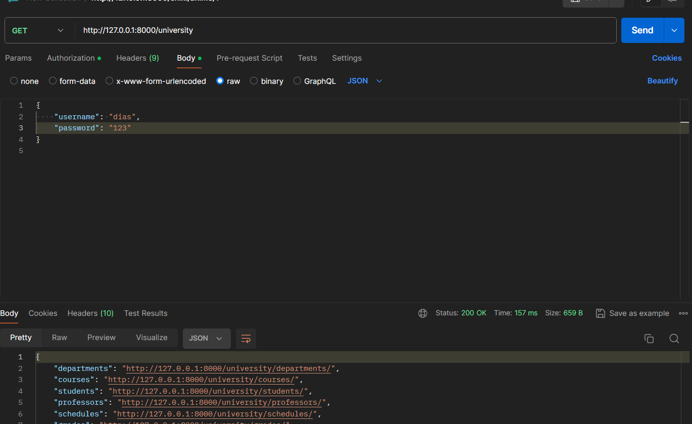
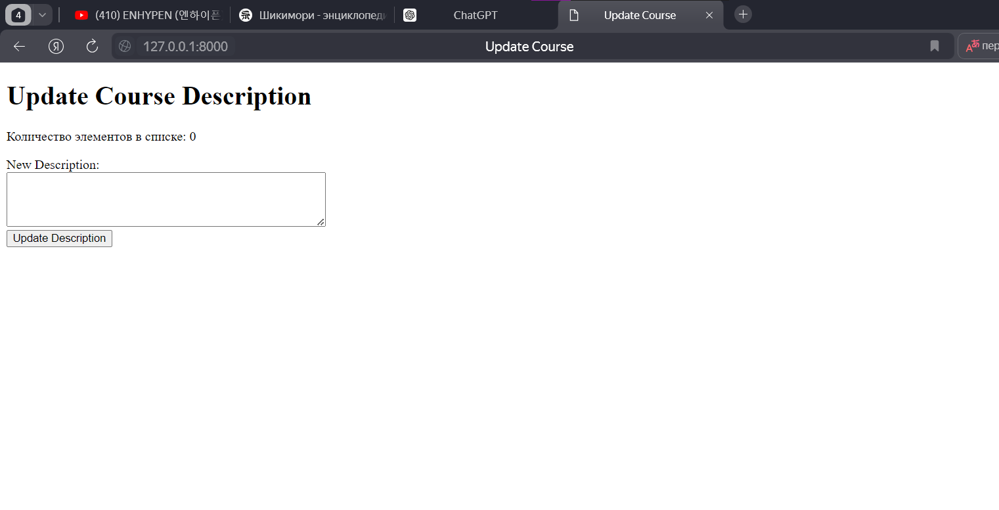
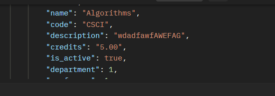

# KBTU_FIT_BACKEND_DJANGO
**KBTU FIT BACKEND DJANGO WIKI**

> Here you can find anything you want

**For you project (homework, midterm / endterm), just fork it**
>https://docs.github.com/ru/pull-requests/collaborating-with-pull-requests/working-with-forks/fork-a-repo
> 
Practice 2:

Create 3 basic views

Practice 2(Basic Views):

Practice Task: Building Basic Views With Django Application

Objective:

To develop Basic Django Application Using Django

Templates

Use headers and unordered list to view students

Students must be python list

You must use Django Templates

Practice 3:

Create Views with Forms

1) Create a simple django view function

2) Create django form

3) Create django template

4) Save instances

Practice 4:

WRITE DJANGO APPLICATION
AT LEAST YOU NEED TO DEVELOP
2 Django Managers with 2 method each
4 Django Models with 2-3 relationship
VIEWS for GET this objects
AND Django form for creating this instances

Practice #5

Group project:https://github.com/Az1tchhh/lecturePractice

Create entire Django Application
At least 4 models
At least 2 relationships
At least 8 methods (4 post, 4 get)
At least 1 abstract class for models
At least 2 custom querysets
At least 6 custom querysets methods
 
Practice #6
Add Django Rest Framework to your midterm.
You need to add drf views with serializers to your current midterm and connect them with your models 

Practice #7
I also added to my midterm
Create dramatiq task for your project, you can choose your business logic

Practice #8
4 endpoints

put
post
delete
get

tests = []
class Test(BaseModel):
    test: x

Practice #9

Fastapi Application
With 3 examples of Dependency Injection

Practice #10
FastAPI Application
Add minimum 3 models with 1 relationalship
add get, post queries for them

Practice  #11
Add websocket endpoint to your API

Final project

DRF
1) 6 Models (Done)
2) 4 Relationships (Done)
3) 1 Template (Done)
4) 2 Filters for templates (Done)
6) Authorization (Done)
7) DRF serializers for all models (Done)
8) Viewsets for all models (Done)
9) 2 DRF Actions (Done)
10) Background Tasks (Dramatiq / Celery) (Done)

Designing a university system using Django and Django REST Framework

Models:

1) Department: Represents a department within the university. It has a name and a unique code.
2) Professor: Represents a professor or faculty member. It contains fields for the first name, last name, and department to which the professor belongs.
3) Course: Represents a specific course offered by the university. It has a name, a unique code, and is associated with a department and a professor.
4) Student: Represents a student enrolled at the university. It contains fields for the first name, last name, and the courses the student is enrolled in (through a Many-to-Many relationship with the Course model).
5) Schedule: Represents the schedule of a course, including the day of the week, start time, and end time. It is associated with a specific course.
6) Grade: Represents the grade of a student in a particular course. It contains fields for the student, the course, and the grade achieved by the student in that course.

Relationships:

> Students can be associated with several groups (many to many).
> Teachers can teach several subjects (one to many).
> Subjects are tied to certain groups and teachers (many to many).
> The schedule is related to the subject, the teacher and the group (many to one).

Functionality:

Registration and authentication of users (students and teachers).
View and edit information about students, teachers, groups, and subjects through the Django admin panel.
API for accessing data about students, teachers, groups, subjects, and schedules.
The ability to view the class schedule for each group.
Grades for subjects, entering them and viewing them for students and teachers.
Filters for viewing schedules by day of the week, groups and teachers.

Needs to be authorized

Works correctly after authorization

dramatiq university.tasks   

Testing Dramatiq task

Successfully done 

Роуты:
Получить список всех департаментов:
GET /api/departments/
Получить список всех курсов:
GET /api/courses/
Получить список всех студентов:
GET /api/students/
Получить список всех преподавателей:
GET /api/professors/
Получить курсы, преподаваемые определенным преподавателем:
GET /api/professors/<professor_id>/courses_taught/
Записать студента на определенный курс:
POST /api/courses/<course_id>/enroll_student/
Тело запроса: {"student_id": "<student_id>"}
Получить список курсов, на которые записан определенный студент:
GET /api/students/<student_id>/enrolled_courses/
Dramatiq таск:
Обновить описание курса:
Вызовите этот таск с помощью HTTP запроса или из кода вашего приложения с помощью Dramatiq, передав идентификатор курса и новое описание.

